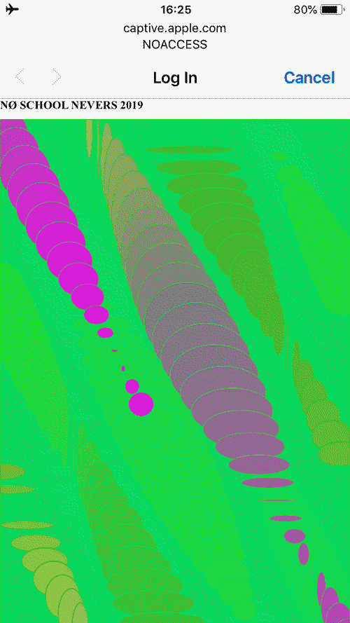

# NØ SCRIPT @ [NØ SCHOOL NEVERS 2019](https://noschoolnevers.com)

<center>

</center>

A collection of modules and walkthroughs for helping you get the most (fun) out of your Raspberry Pi.

Grab the goods:

```
git clone https://github.com/phillipdavidstearns/noscript.git
```
## [NØ RESOURCES](NORESOURCES/)

* [NØ CONNECTION](NORESOURCES/NOCONNECTION.md) - Connecting to our Pis over Secure Shell (ssh)
* [NØ CONFIGURATION](NORESOURCES/NOCONFIGURATION.md) - Configuring Raspberry Pis to connect to a personal Wifi Hotspot
* [NØ PIPING](NORESOURCES/NOPIPING.md) - Piping and Redirection using fun hackery tools
* [NØ DATA FILTERING](NORESOURCES/NODATAFILTERING.md) - Data pre-visualisation and filtering
* [NØ DATA CONVERSION](NORESOURCES/NODATACONVERSION.md) - Transforming information on the command line
* [NØ HOSTING](NORESOURCES/NOHOSTING.md) - Host an HTTP Server (webpage) on your Pi
* [NØ ACCESS](NORESOURCES/NOACCESS.md) - Setting up the Raspberry Pi to act as a WiFi access point and serve up a captive portal.

A class by [Jerome Saint-Claire](https://www.saint-clair.net/) and [Phillip David Stearns](https://phillipstearns.com)